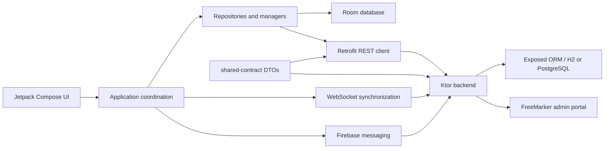

# CJLU Student App: Project Analysis and Test Report

**Project:** CJLU Student App  
**Report date:** June 15, 2026  
**Scope:** Android application, shared API contract, Ktor backend, admin portal, build configuration, and automated tests  
**Assessment basis:** Source-code inspection, Gradle build, Android lint, fresh JVM test execution, and live backend startup

## 1. Introduction

The CJLU Student App is a full-stack student-service system for China Jiliang University. It combines:

- A native Android application written in Kotlin and Jetpack Compose.
- A Ktor backend providing REST APIs, WebSocket updates, authentication, file upload, and an administrative portal.
- A shared Kotlin serialization module used by both client and server.
- Room local storage for cached academic data, messages, and service requests.
- Firebase Cloud Messaging and an Android foreground WebSocket service for notifications.
- A Glance home-screen widget for unread-message and active-request information.

The application supports student authentication, profile maintenance, attendance and transcript viewing, class schedules, dormitory information, school-calendar data, campus-service requests, messages, bilingual English/Chinese presentation, and near-real-time updates.

The active Gradle build contains three modules:

```text
app               Android client
backend-ktor      Ktor API and FreeMarker admin portal
shared-contract   Shared serializable API data classes
```

The repository also contains `cjlu-student-backend/`, which appears to be a second or historical copy of the backend. It is not included in the root Gradle build and should not be treated as part of the active implementation unless this duplication is intentional.

## 2. Project Requirements

### 2.1 Functional requirements

Based on the implementation, the main functional requirements are:

1. **Student authentication**
   - Sign in with student ID and password.
   - Store and restore a JWT-authenticated session.
   - Change the current password.
   - Log out and clear local session state.

2. **Student profile**
   - Display student ID, name, class, major, and school.
   - Allow selected academic profile fields to be updated.
   - Support English, Chinese, and system-language selection.

3. **Academic information**
   - Display overall and course attendance.
   - Show weekly attendance trends.
   - Display transcript courses, grades, credits, and GPA.
   - Display class timetable, rooms, and times.
   - Display academic calendar months and events.
   - Display dormitory and leave/off-campus information.

4. **Campus services**
   - Load a catalog of more than 20 student services.
   - Search and browse services by category.
   - Render service-specific forms from UI models.
   - Validate required fields and student IDs.
   - Upload supporting documents.
   - Submit and track requests through status changes.

5. **Messages and notifications**
   - Display broadcast and student-specific inbox messages.
   - Mark messages as read or unread.
   - Receive WebSocket update events.
   - Register FCM tokens and receive background push data.
   - Create Android notification channels and notifications.

6. **Offline and local-first behavior**
   - Read cached academic data when the API is unavailable.
   - Retain locally synchronized messages and requests.
   - Cache the service catalog with a built-in fallback.
   - Refresh local data after realtime events.

7. **Administration**
   - Authenticate administrators through a web portal.
   - Review and update requests.
   - Update attendance, timetable, transcript, calendar, and learning-alert information.
   - Send broadcast or targeted messages.

### 2.2 Non-functional requirements

- **Platform:** Android 11 and later (`minSdk 30`).
- **Language:** Kotlin with JDK 17.
- **UI:** Jetpack Compose and Material 3.
- **Localization:** English and Simplified Chinese.
- **Security:** Student API key, JWT bearer authentication, BCrypt password hashes, protected uploads, and admin sessions.
- **Reliability:** Local cache fallback during network failure.
- **Maintainability:** Shared DTO contract between Android and backend.
- **Compatibility:** `compileSdk 36`, `targetSdk 36`.
- **Testing:** JVM unit tests, Ktor integration/contract tests, Android instrumentation tests, lint, and CI compilation.

### 2.3 Environment requirements

- Android Studio with Android SDK 36.
- JDK 17.
- Gradle wrapper supplied by the project.
- Backend port 8080 by default.
- `local.properties` values for API host, port, and student API key.
- An emulator using `10.0.2.2`, or a physical device configured with the development machine's LAN address.
- Firebase configuration for real FCM delivery.
- PostgreSQL for deployment, or the current H2 default for local development.

## 3. Architecture Overview



The design is a pragmatic layered architecture rather than strict Clean Architecture. Screens call callbacks supplied by `MainActivity` and `AppNavigation`; repositories and singleton managers coordinate Room and network access. This works, but the activity currently carries responsibilities normally assigned to ViewModels and use cases.

## 4. UI Design

### 4.1 Design system

The application uses Material 3 with a custom CJLU palette:

- Blue primary color for identity, navigation, and important actions.
- Teal secondary color for positive or supporting information.
- Light neutral background and white surfaces.
- Dark-theme colors are defined, although `MainActivity` currently forces the light theme.
- Edge-to-edge layout is enabled.

The main navigation uses four bottom-level destinations:

- Home
- Services
- Messages
- Profile

Additional destinations include attendance details, school calendar, service hubs, and service detail/form pages.

### 4.2 Screen design

**Login:** A focused authentication screen with localized labels, password handling, validation feedback, and a prefilled development student ID.

**Home:** A dashboard with student greeting, attendance metrics, quick actions, service tiles, active requests, and attention notices.

**Services:** Search, service statistics, popular services, category browsing, and active-request badges.

**Service hub and forms:** Service information and history are separated into tabs. Form screens are generated from structured models supporting read-only fields, text input, multiline input, date pickers, dropdowns, radio groups, uploads, agreements, and tips.

**Messages:** Summary cards, message filters, message cards, detail sheets, action routing, read state, and an offline notice.

**Profile:** Identity card, QR-like student display, request history, language selection, profile editing, password change, notification preferences, and logout.

**Academic detail screens:** Attendance charts, course cards, transcript rows, timetable cards, dormitory details, and an interactive school calendar.

### 4.3 UI strengths

- Consistent use of cards, spacing, color, and Material components.
- Broad feature coverage and clear primary navigation.
- Reusable form components reduce repeated UI implementation.
- English and Chinese string-resource counts are equal at 346 each.
- Loading, empty, cached, and error states exist on major data screens.
- Accessibility benefits from Material semantics and standard controls.

### 4.4 UI weaknesses

- Only one Compose preview was found, limiting fast visual regression review.
- Several screens are very large: `ProfileScreen.kt` exceeds 1,000 lines, `ServiceRequestContent.kt` exceeds 1,300 lines, and `ServiceFormCatalog.kt` exceeds 1,500 lines.
- Some user-visible strings remain hardcoded in Kotlin, especially foreground-service notifications, offline messages, and `"No events"`.
- Dark colors are defined but the app explicitly disables dark theme and dynamic color in `MainActivity`.
- Navigation uses untyped string routes. The optional course name is placed directly in a route without URL encoding, so names containing `/`, `?`, or `#` can break navigation.
- Lint found two Compose modifier-order warnings and two primitive-state autoboxing hints.

## 5. Design of Model Classes

### 5.1 Shared API models

`shared-contract/src/main/kotlin/com/cjlu/contract/ApiModels.kt` is the primary source of truth for API DTOs. It defines:

- Authentication models.
- Student profile models.
- Request and request-status models.
- Service catalog models.
- Message models.
- Attendance, transcript, dormitory, timetable, and calendar models.
- Realtime push payloads.

The Android and backend modules mostly re-export these types through Kotlin `typealias` declarations. This is a strong design choice because serialization fields and status values cannot silently diverge between client and server.

### 5.2 Android persistence models

Room stores three entity groups:

1. `StudentRequest`
   - Request identity, service, student, contact information, notes, status, creation time, and attachment URL.

2. `InboxMessage`
   - Message identity, owning student, category, sender, content, relation to a service, action requirement, and read state.

3. `AcademicCacheEntry`
   - Composite key of student ID and cache key.
   - Serialized JSON payload.
   - Fetch timestamp and source version.

DAOs expose `Flow` for reactive UI updates and suspend functions for synchronization.

### 5.3 Form UI models

The form system uses a sealed `FormFieldUiModel` hierarchy:

- `ReadOnly`
- `TextInput`
- `MultilineInput`
- `DatePicker`
- `Dropdown`
- `RadioGroup`

Supporting models represent options, uploads, agreements, tips, and bilingual `UiText`. This is an appropriate use of sealed classes because each field type has a closed set of rendering and validation rules.

### 5.4 Backend database models

The backend uses Exposed table objects for:

- Application configuration.
- Students.
- Student requests.
- Service catalog.
- Inbox messages and per-student read receipts.
- FCM tokens.
- Academic records managed by `AcademicRepository`.

Passwords are stored as BCrypt hashes. API secrets are read from environment/configuration and JWTs identify authenticated students.

### 5.5 Model-design concerns

- `InboxMessage` uses only `id` as its Room primary key even though it also stores `studentId`. The same message ID synchronized for two different students can replace the first student's row. A composite primary key of `(studentId, id)` would be safer.
- Inbox ordering uses the localized `timeLabel` string rather than a numeric timestamp, so chronological order can be incorrect.
- `StudentRequest` has no local sync state, retry count, or pending-operation fields. Therefore the documentation's claim of an offline submission queue is not supported by the current model.
- Room schema export is disabled, reducing migration review and schema-history safety.
- Backend migration code uses an Exposed API that emitted a deprecation warning during fresh compilation.

## 6. Design and Development Tools

| Area | Tool or technology | Purpose |
|---|---|---|
| Language | Kotlin 2.2.10 | Android, backend, and shared code |
| Android UI | Jetpack Compose + Material 3 | Declarative mobile interface |
| Navigation | Navigation Compose | Screen routing |
| Local database | Room + KSP | Offline cache and reactive local data |
| REST client | Retrofit + OkHttp | Android-to-backend HTTP communication |
| Realtime client | Ktor client WebSockets | Live update connection |
| Push | Firebase Cloud Messaging | Background notification delivery |
| Widget | Jetpack Glance | Android home-screen widget |
| Backend | Ktor 3 | REST, WebSocket, auth, uploads, and server |
| ORM | JetBrains Exposed | Relational database access |
| Database | H2 / PostgreSQL | Local development and deployment storage |
| Admin UI | FreeMarker, CSS, JavaScript | Server-rendered staff portal |
| Serialization | kotlinx.serialization | Shared JSON contract |
| Security | JWT, BCrypt, API key | Authentication and password storage |
| Build | Gradle Kotlin DSL | Multi-module build automation |
| Tests | JUnit, Ktor test host, MockWebServer, AndroidX Test | Unit, contract, integration, and device tests |
| CI | GitHub Actions | Backend tests and Android debug compilation |

## 7. Testing Performed

### 7.1 Commands

```bash
./gradlew :shared-contract:build :backend-ktor:test \
  :app:testDebugUnitTest :app:lintDebug :app:assembleDebug

./gradlew :backend-ktor:test :app:testDebugUnitTest \
  --rerun-tasks --console=plain

./gradlew :backend-ktor:run --console=plain
```

### 7.2 Results

| Check | Result |
|---|---|
| Shared contract build | Passed |
| Backend compilation | Passed |
| Backend tests | 21 passed, 0 failed |
| Android unit tests | 7 passed, 0 failed |
| Android debug APK assembly | Passed |
| Android lint task | Passed |
| Lint findings | 0 errors, 160 warnings, 2 hints |
| Backend live startup | Passed; listening on port 8080 |
| Android instrumentation tests | Not executed; no emulator/device was available |

The generated debug APK is approximately 73.9 MB.

### 7.3 Test coverage assessment

Backend coverage is the strongest area. Tests verify:

- Login and shared DTO deserialization.
- Service, profile, academic, message, and request endpoints.
- Targeted-message visibility.
- Request submission.
- Password change.
- Academic updates from admin operations.
- FCM token registration.
- Dormitory leave updates.
- Attendance correction behavior.
- Admin authentication and page rendering.
- Upload ownership and authorization.

Android unit tests cover request filtering and realtime push parsing. Instrumentation tests define 10 cases for launch, Compose login UI, network fallback, recovery, widget registration, notifications, and real backend login. However:

- `BackendDownInstrumentedTest` only asserts `true`.
- `SyncRecoveryInstrumentedTest` only asserts `true`.
- The real login instrumentation test requires a running backend and emulator.
- No screenshot, accessibility, navigation-flow, or full form-submission UI tests are present.

## 8. Problems Encountered and Solutions

### 8.1 Insecure TLS trust manager

**Problem:** Android lint reports that `NotificationWebSocketService` installs a custom trust manager whose verification methods are empty. This trusts arbitrary certificates and can enable man-in-the-middle attacks.

**Solution:** Remove the custom trust manager and use Android's default certificate validation. For development certificates, use a debug-only network security configuration or certificate pinning scoped to a controlled environment. Never ship trust-all TLS behavior in release builds.

**Priority:** Critical before production.

### 8.2 Release API key silently falls back to an insecure value

**Problem:** The README says release builds require a configured student API key, but `app/build.gradle.kts` falls back to the known development key when the release property is missing.

**Solution:** Fail release configuration with `error(...)` when the key is absent. Prefer not embedding a long-lived shared secret in an APK at all; rely on authenticated student tokens and server-side controls.

**Priority:** High.

### 8.3 Oversized activity and screen files

**Problem:** `MainActivity` coordinates authentication, repositories, realtime state, notifications, widget updates, navigation, and UI state. Several screens contain hundreds or more than one thousand lines.

**Solution:** Introduce screen-level ViewModels exposing immutable `StateFlow` UI states. Split large screens into focused components and move transformation/validation logic into testable classes. Use dependency injection or explicit factories for repositories and coordinators.

**Priority:** High for maintainability.

### 8.4 Offline queue documentation does not match behavior

**Problem:** Project documentation mentions an offline request-sync queue, but request creation currently calls the API directly and returns failure when offline. The Room model has no pending-sync state.

**Solution:** Either correct the documentation or implement a real queue using Room fields such as `syncState`, `lastAttemptAt`, and `retryCount`, then process it with WorkManager under network constraints.

**Priority:** High because it affects user expectations.

### 8.5 Message key and ordering design

**Problem:** Local messages use a globally unique `id` primary key and sort by a human-readable label. This can cause cross-student replacement and incorrect ordering.

**Solution:** Use `(studentId, id)` as a composite key and add `sentAtMillis`. Sort by the timestamp in SQL.

**Priority:** Medium to high.

### 8.6 Non-transactional synchronization

**Problem:** Message and request synchronization deletes all local rows before inserting the server response. A failure between operations can leave empty or partial local data.

**Solution:** Add DAO methods annotated with `@Transaction` that replace data atomically. Consider upsert plus removal of stale IDs to avoid visible empty states.

**Priority:** Medium.

### 8.7 Navigation argument encoding

**Problem:** Course names are concatenated directly into string routes.

**Solution:** Apply `Uri.encode`/decode consistently, or migrate to type-safe Navigation Compose destinations using serializable route objects.

**Priority:** Medium.

### 8.8 Localization inconsistency

**Problem:** Resource localization is extensive, but some strings are embedded directly in Kotlin or represented through a separate `UiText` system.

**Solution:** Centralize user-visible copy in Android resources, including plurals and notification strings. Keep DTO-provided localized content separate from app-owned UI labels.

**Priority:** Medium.

### 8.9 Lint and dependency maintenance

**Problem:** Lint reports 160 warnings. Many are unused resources and dependency-update notices, but others include locale formatting, plural handling, redundant SDK checks, Compose API conventions, and version-catalog consistency.

**Solution:** Triage warnings by risk:

1. Security warnings.
2. Locale and plural correctness.
3. Compose conventions and obsolete checks.
4. Unused resources.
5. Dependency upgrades, performed in controlled groups with regression tests.

**Priority:** Mixed.

### 8.10 Database migration robustness

**Problem:** Fresh backend compilation warns that the current Exposed missing-table/column migration helper is deprecated and may leave unpredictable state after failure. Room schema export is also disabled.

**Solution:** Adopt Flyway or Liquibase for backend migrations. Enable Room schema export, commit schemas, and add migration tests.

**Priority:** Medium before production data is important.

### 8.11 Duplicate backend directory and generated artifacts

**Problem:** The repository includes an active `backend-ktor` module, a second `cjlu-student-backend` tree, generated build outputs, an APK, and test reports. This creates ambiguity and large diffs.

**Solution:** Establish one canonical backend source tree. Remove generated outputs from version control and strengthen `.gitignore`. Document any intentionally retained deployment mirror.

**Priority:** Medium.

### 8.12 Limited runtime UI verification

**Problem:** No emulator was available during this assessment, so instrumentation tests were not executed. Two instrumentation tests are placeholders.

**Solution:** Add a CI emulator job or Firebase Test Lab execution. Replace placeholder tests with assertions against repository state and UI behavior. Add critical-flow tests for login, offline cached launch, service submission, messages, language change, and logout.

**Priority:** High for release confidence.

## 9. Overall Evaluation

### Strengths

- Broad and coherent student-service feature set.
- Modern Android technology choices.
- Shared client/server contract is an excellent architectural decision.
- Strong backend integration and authorization test coverage.
- Local caching and realtime update design are thoughtfully connected.
- Complete English/Chinese string-resource parity.
- Build, lint task, APK assembly, backend tests, Android unit tests, and backend startup all succeed.

### Weaknesses

- A critical trust-all TLS implementation exists.
- Runtime orchestration is concentrated in `MainActivity`.
- UI and form files have grown too large.
- Android test depth is substantially lower than backend test depth.
- Offline submission behavior is overstated in documentation.
- Local message schema and synchronization should be hardened.
- Release configuration does not enforce the security requirement described by the documentation.

## 10. Summary and Conclusion of the Total Project Experience

This project demonstrates a substantial full-stack Android implementation rather than a simple prototype. It covers mobile UI, local persistence, REST APIs, WebSockets, push notifications, widgets, localization, a shared contract, server-side administration, authentication, uploads, and automated testing. The strongest engineering decisions are the shared DTO module, the backend contract tests, the local academic cache, and the structured service-form model.

The project is currently buildable and its JVM-side automated checks pass. The backend also starts successfully in the local development configuration. These results provide good evidence that the central client/server contract and backend workflows are functional.

The main lesson from the project is that feature growth has outpaced structural refinement on the Android side. Large Compose files and activity-level coordination made it possible to deliver many features quickly, but they now increase the cost of testing and change. A second major lesson is that passing builds do not imply production readiness: the TLS trust manager, release-key fallback, migration strategy, and missing device-test execution require attention.

Overall, the project is a capable late-stage academic or pre-production system with a solid functional foundation. It should not be considered production-ready until the critical security issue is removed, release configuration is hardened, real Android instrumentation tests pass on a device, and the highest-risk data synchronization and schema concerns are addressed.

### Recommended next order of work

1. Remove trust-all TLS handling and enforce secure release configuration.
2. Run and repair all instrumentation tests on an emulator/device.
3. Correct message keys, timestamps, and transactional sync.
4. Align offline-queue documentation with the implementation.
5. Introduce ViewModels and split the largest Compose files.
6. Add formal database migrations and schema tests.
7. Reduce lint warnings and modernize dependencies incrementally.
