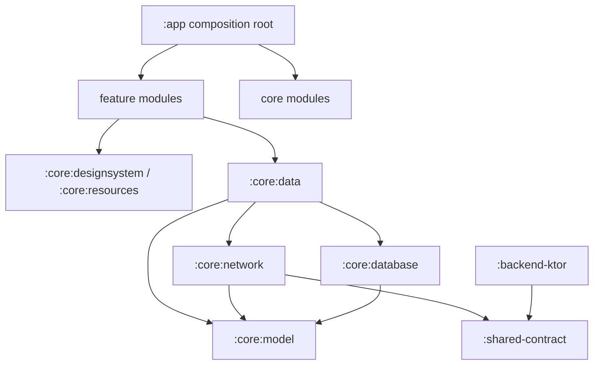
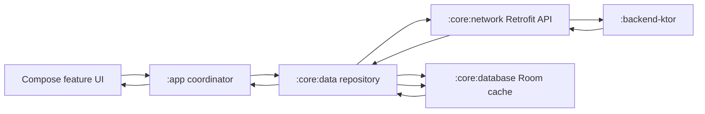
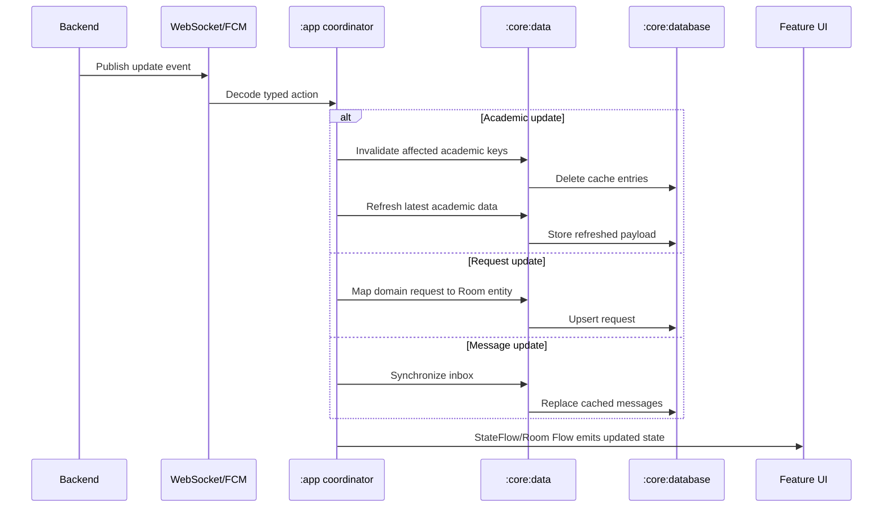

# CJLU Student App Architecture

The project is a modular monolith. Android features compile independently, while shared
infrastructure is kept in focused core modules. The Ktor backend and the serializable API
contract remain part of the same Gradle build.

## Module ownership

| Module | Responsibility |
| --- | --- |
| `:app` | Android entry point, application composition, top-level navigation, notifications and widgets |
| `:core:model` | Android domain models shared by features |
| `:core:network` | Retrofit API, authentication token state and client configuration |
| `:core:database` | Room database, DAOs, entities and migrations |
| `:core:data` | Repository implementations, cache policy and entity/domain mapping |
| `:core:preferences` | Language and user preference persistence |
| `:core:resources` | Shared strings, translations and XML theme resources |
| `:core:designsystem` | Compose colors, typography and Material theme |
| `:core:navigation` | Shared route definitions and navigation helpers |
| `:feature:auth` | Login presentation |
| `:feature:home` | Home dashboard presentation |
| `:feature:academic` | Attendance, timetable, transcript, calendar and dormitory presentation |
| `:feature:services` | Service catalog, forms, submissions and request presentation |
| `:feature:messages` | Inbox presentation |
| `:feature:profile` | Profile and settings presentation |
| `:shared-contract` | Kotlin serialization DTOs shared by Android and Ktor |
| `:backend-ktor` | Backend API, persistence, WebSocket and admin application |

## Dependency direction

## Data and cache flow

Repositories use network-first reads for synchronized data. When a recoverable network
failure occurs, academic, request and message repositories read the local Room cache.

## Realtime synchronization and invalidation

Cache invalidation is explicit and key based. Academic updates delete only the affected
student's cache entries before reloading. Request and message events upsert or synchronize
their respective tables.

## Migration rules

1. New UI belongs in the owning `feature` module.
2. Feature modules must not depend on `:app`.
3. Transport DTOs stay in `:shared-contract` or `:core:network`.
4. Room entities stay in `:core:database`; domain models stay in `:core:model`.
5. Mapping between transport, persistence and domain models belongs in `:core:data`.
6. Reusable Compose styling belongs in `:core:designsystem`.
